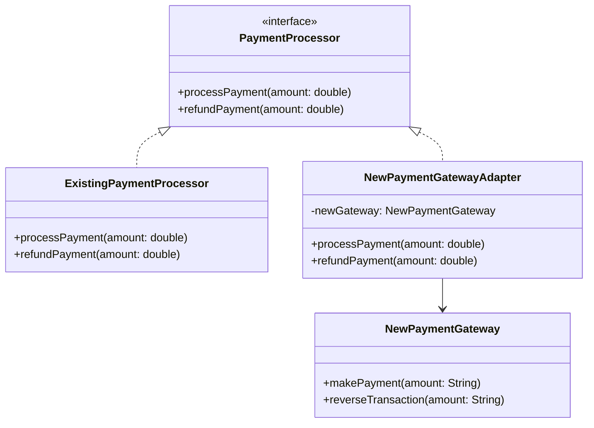
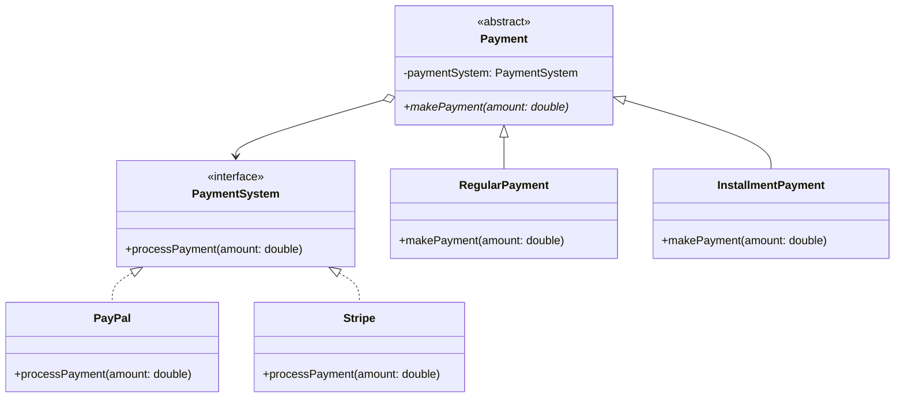
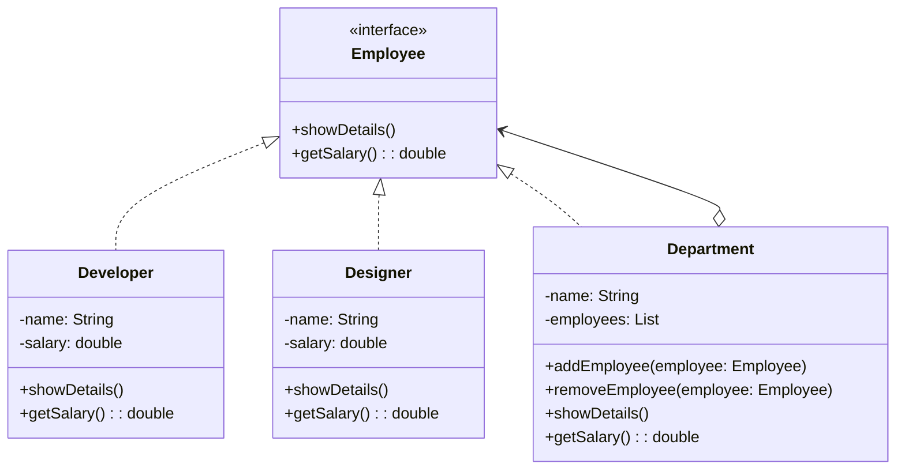
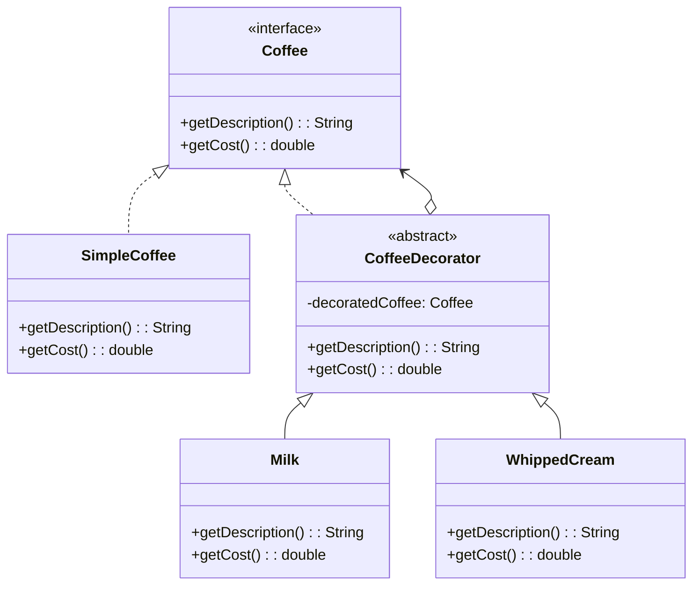
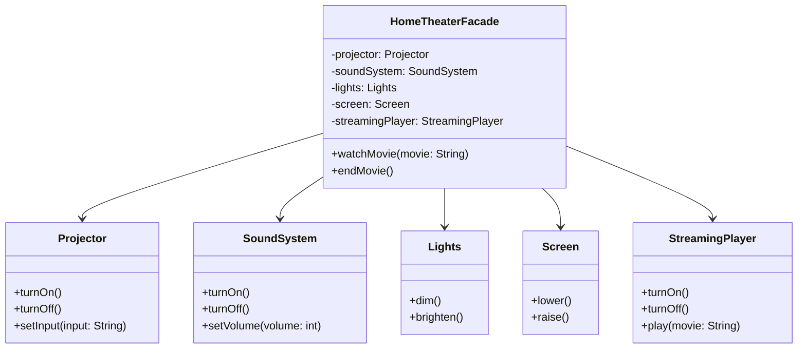
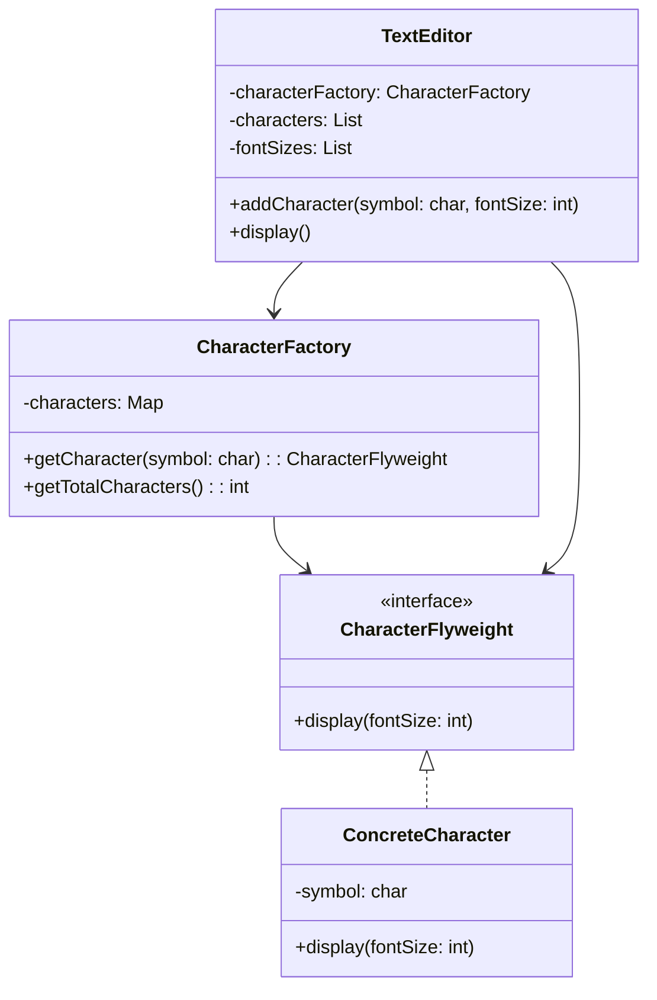
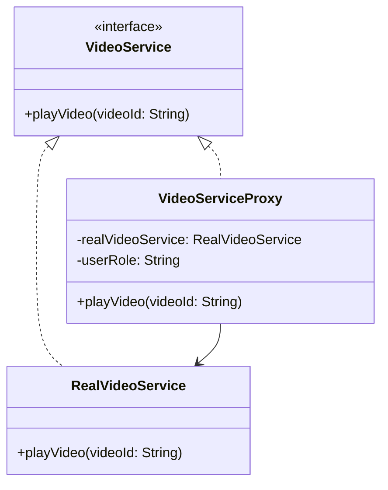
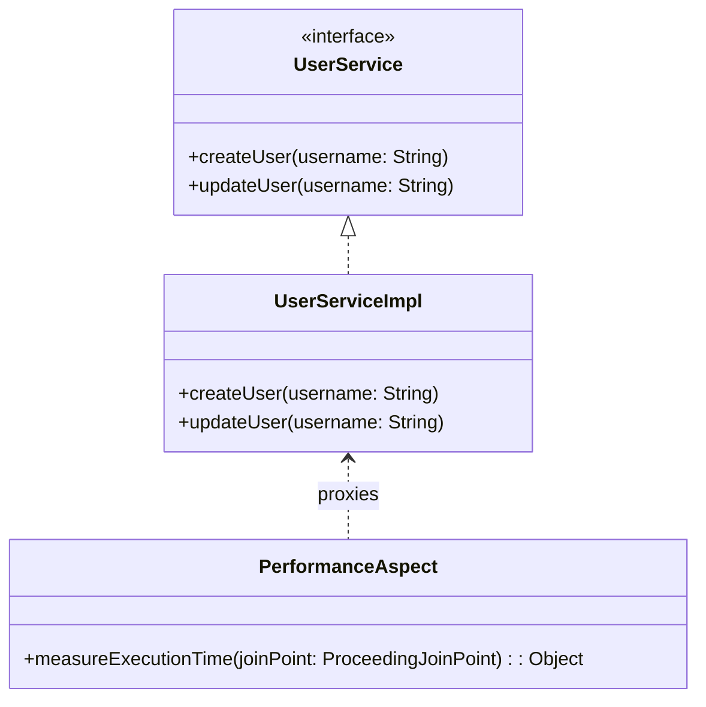

# Structural Design Patterns

In this project, we have implemented seven core structural design patterns. Below is a brief description of each pattern, an implementation example, and a diagram.

## 1. Adapter

**Description:** The Adapter pattern allows objects with incompatible interfaces to work together.

**Implementation Example:** We created an adapter to integrate a new payment gateway into an existing payment processing system.

**Diagram:**

## 2. Bridge

**Description:** The Bridge pattern separates abstraction from implementation, allowing them to vary independently.

**Implementation Example:** We created a system for different types of payments (regular, installment, subscription) and various payment systems (PayPal, Stripe, bank transfer).

**Diagram:**

## 3. Composite

**Description:** The Composite pattern allows clients to treat individual objects and compositions of objects uniformly.

**Implementation Example:** We created a company structure with departments and employees, where both individual employees and entire departments implement a common interface.

**Diagram:**

## 4. Decorator

**Description:** The Decorator pattern adds new functionality to an object dynamically without altering its structure.

**Implementation Example:** We created a system for a coffee shop where a basic coffee can be enhanced with various ingredients (milk, whipped cream, vanilla).

**Diagram:**

## 5. Facade

**Description:** The Facade pattern provides a unified interface to a set of interfaces in a subsystem.

**Implementation Example:** We created a facade for managing a home theater system, which simplifies the interaction with various devices (projector, sound system, lighting, etc.).

**Diagram:**

## 6. Flyweight

**Description:** The Flyweight pattern uses sharing to support a large number of fine-grained objects efficiently.

**Implementation Example:** We created a text editor where each character is represented by a separate object, but objects for identical characters are shared.

**Diagram:**

## 7. Proxy

**Description:** The Proxy pattern provides a surrogate or placeholder for another object to control access to it.

**Implementation Example:** We created a proxy for a video service that controls access based on user roles, and also implemented an example using Spring AOP to measure method execution time.

**Diagram for simple Proxy:**

**Diagram for Spring AOP Proxy:**

These implementations demonstrate the application of structural design patterns in various scenarios, showcasing their flexibility and usefulness in solving different software design problems.