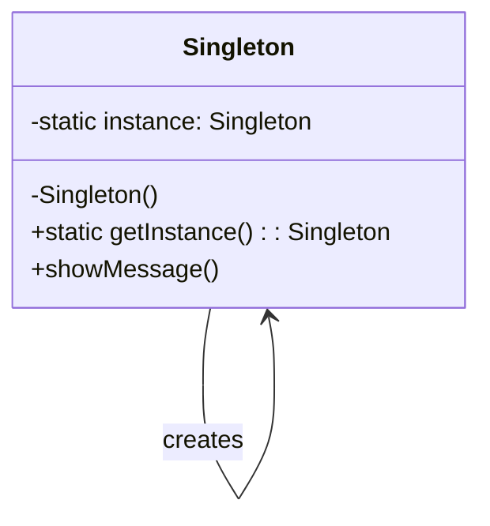
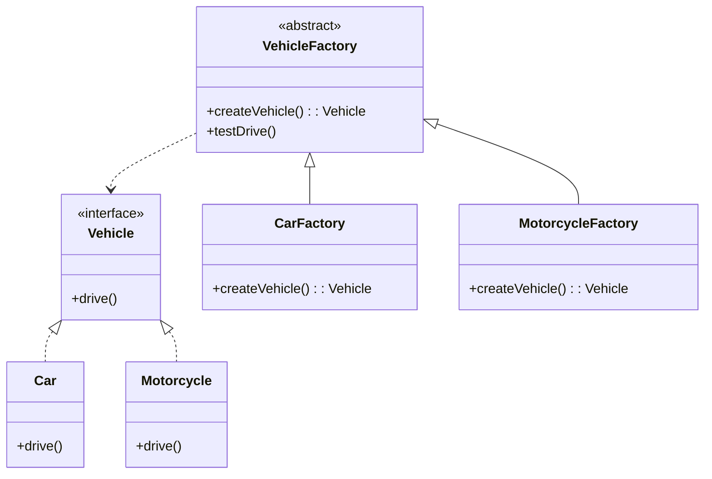
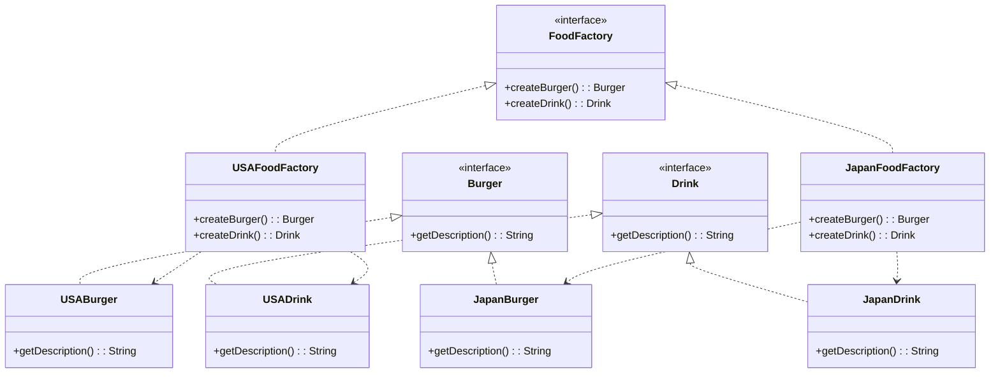
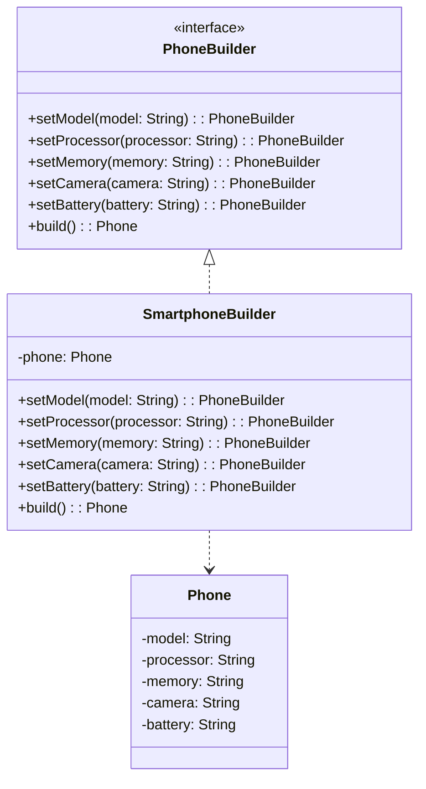
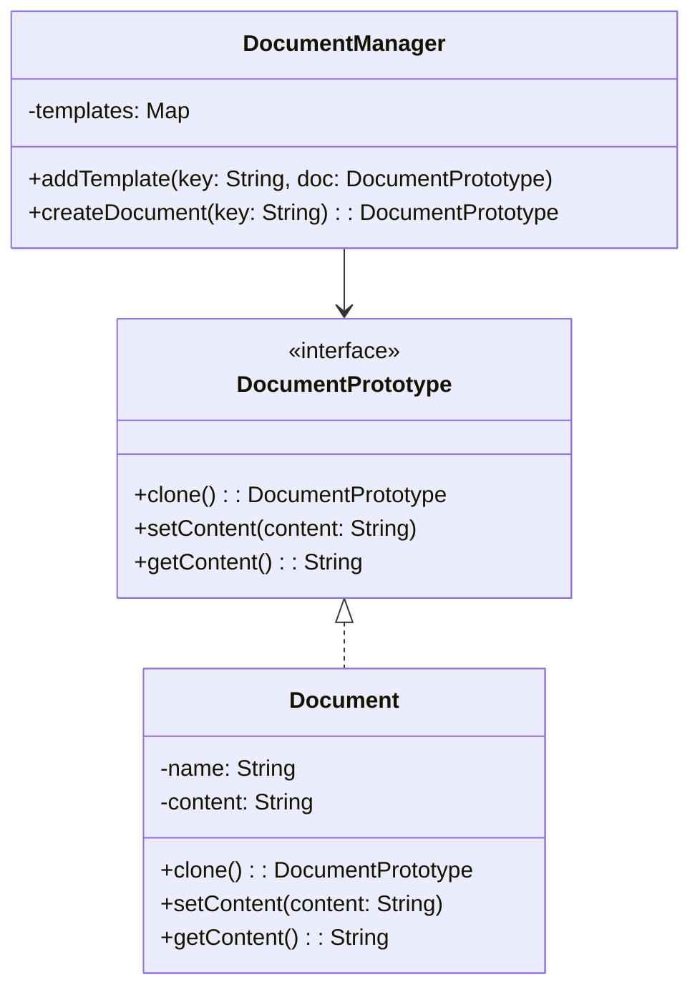

# Design Patterns: Overview and Implementations

This document provides an overview of both creational and structural design patterns implemented in our project.

## Creational Design Patterns

Creational design patterns are concerned with the way of creating objects. These patterns are used when a decision must be made at the time of instantiation of a class.

### 1. Singleton

**Description:** The Singleton pattern ensures a class has only one instance and provides a global point of access to it.

**Implementation Example:** We created a Singleton class that manages a single instance of itself.

**Diagram:**

### 2. Factory Method

**Description:** The Factory Method pattern defines an interface for creating an object, but lets subclasses decide which class to instantiate.

**Implementation Example:** We implemented a vehicle factory that can create different types of vehicles.

**Diagram:**

### 3. Abstract Factory

**Description:** The Abstract Factory pattern provides an interface for creating families of related or dependent objects without specifying their concrete classes.

**Implementation Example:** We created an abstract factory for producing different types of food items in different cuisines.

**Diagram:**

### 4. Builder

**Description:** The Builder pattern separates the construction of a complex object from its representation, allowing the same construction process to create various representations.

**Implementation Example:** We implemented a phone builder that can create different configurations of phones.

**Diagram:**

### 5. Prototype

**Description:** The Prototype pattern specifies the kinds of objects to create using a prototypical instance, and create new objects by copying this prototype.

**Implementation Example:** We created a document prototype system where new documents can be created by cloning existing ones.

**Diagram:**

# Structural Design Patterns

In this project, we have implemented seven core structural design patterns. Below is a brief description of each pattern, an implementation example, and a diagram.

## 1. Adapter

**Description:** The Adapter pattern allows objects with incompatible interfaces to work together.

**Implementation Example:** We created an adapter to integrate a new payment gateway into an existing payment processing system.

**Diagram:**

## 2. Bridge

**Description:** The Bridge pattern separates abstraction from implementation, allowing them to vary independently.

**Implementation Example:** We created a system for different types of payments (regular, installment, subscription) and various payment systems (PayPal, Stripe, bank transfer).

**Diagram:**

## 3. Composite

**Description:** The Composite pattern allows clients to treat individual objects and compositions of objects uniformly.

**Implementation Example:** We created a company structure with departments and employees, where both individual employees and entire departments implement a common interface.

**Diagram:**

## 4. Decorator

**Description:** The Decorator pattern adds new functionality to an object dynamically without altering its structure.

**Implementation Example:** We created a system for a coffee shop where a basic coffee can be enhanced with various ingredients (milk, whipped cream, vanilla).

**Diagram:**

## 5. Facade

**Description:** The Facade pattern provides a unified interface to a set of interfaces in a subsystem.

**Implementation Example:** We created a facade for managing a home theater system, which simplifies the interaction with various devices (projector, sound system, lighting, etc.).

**Diagram:**

## 6. Flyweight

**Description:** The Flyweight pattern uses sharing to support a large number of fine-grained objects efficiently.

**Implementation Example:** We created a text editor where each character is represented by a separate object, but objects for identical characters are shared.

**Diagram:**

## 7. Proxy

**Description:** The Proxy pattern provides a surrogate or placeholder for another object to control access to it.

**Implementation Example:** We created a proxy for a video service that controls access based on user roles, and also implemented an example using Spring AOP to measure method execution time.

**Diagram for simple Proxy:**

**Diagram for Spring AOP Proxy:**

These implementations demonstrate the application of structural design patterns in various scenarios, showcasing their flexibility and usefulness in solving different software design problems.